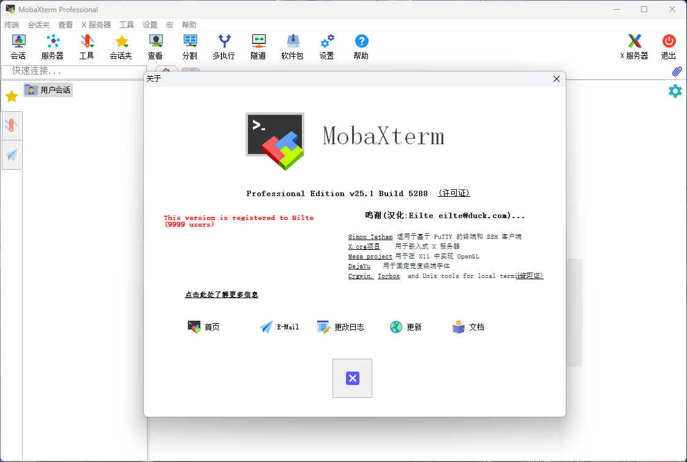
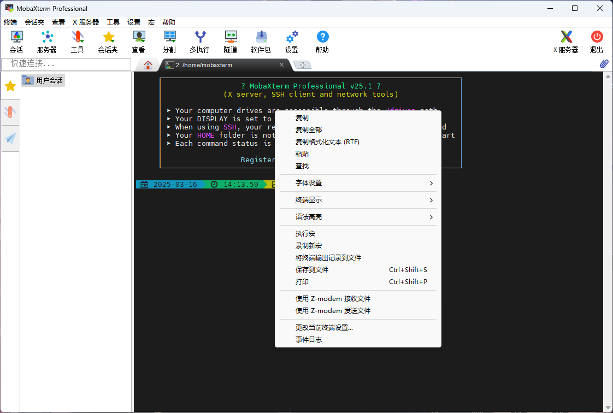
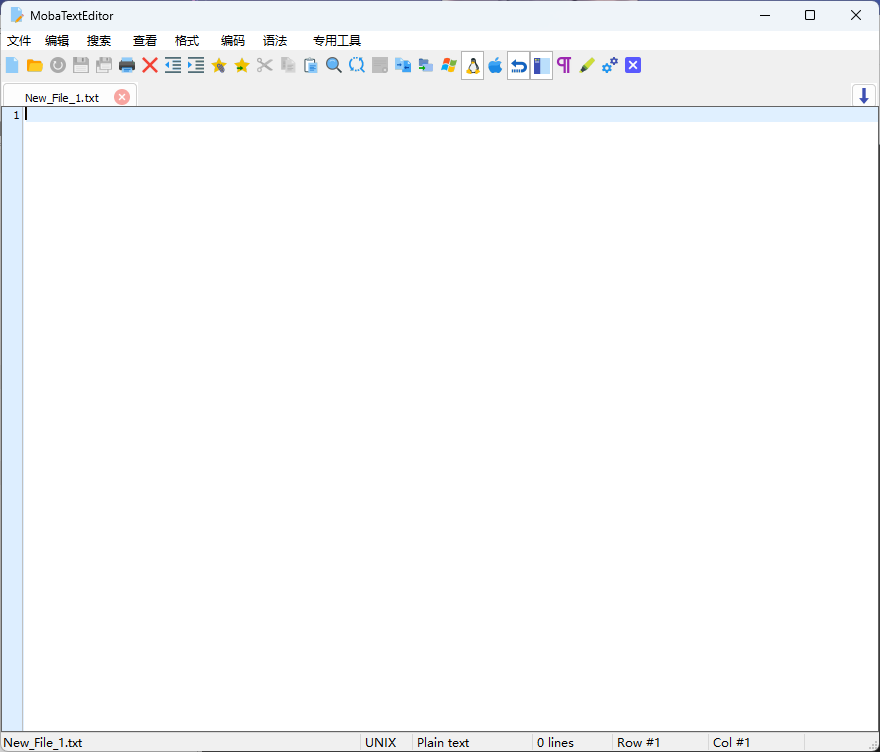

## Mobaxterm-Chinese
Amateur project, only for personal use, update cycle is irregular

The original intention of this project is only to satisfy my own use of new features

业余项目，仅用于个人使用，更新周期不定

该项目的初衷仅为满足自己对新功能的使用

## Bug
自定义按钮栏后保存导致按钮栏消失的情况，消失后重启软件即可解决，该问题仍未修复

高分屏显示少字，错位，不显示的问题解决方法

1、mobexterm安装路径下，鼠标右键Mobexterm选择属性；

2、弹出窗口“兼容性”——“更改高DPI设置”；

3、在高DPI缩放替代栏，勾选“替代高DPI缩放行为。”，在缩放执行下拉列表内勾选“系统”（或系统增强）——点击“确定”完成设置。

4、重新打开Mobexterm显示恢复正常。

## Photo

## Target
Waiting for the next major version.
